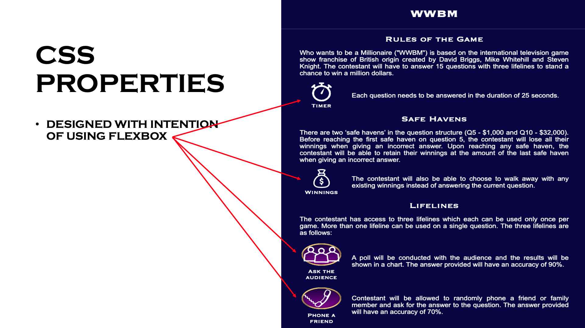
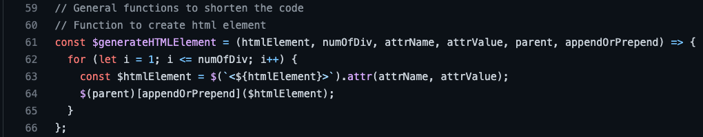

#  Project #1: The Game

### Technical Requirements
The game app needs to:
- Display a game in the browser
- Be interactive
- Include separate HTML / CSS / JavaScript files
- Use Javascript for DOM manipulation that is triggered by a browser event

# Who wants to be a Millionaire ("WWBM")

This game is based on the international television game show franchise of British origin created by David Briggs, Mike Whitehill and Steven Knight. The contestant will have to answer 3 questions with three lifelines to stand a chance to win a million dollars.

## Where to Play
Play [Who Wants to be a Millionaire](https://wwbm.vercel.app/).

## Rules
- The contestant will have to answer 15 random questions and climb up the prize ladder to win the a million dollars. A total of 150 questions have been set into the game with 10 questions per level.
- The contestant is given 25 seconds to answer each question per round.
- There are three ‘safe havens’ in the question structure (Q5 - $1,000, Q10 - $32,000 and Q15 - $1,000,000). Before reaching the first safe haven on question 5, the contestant will lose all their winnings when giving an incorrect answer. Upon reaching any safe haven, the contestant will be able to retain their winnings at the amount of the last safe haven when giving an incorrect answer.
- The contestant will also have the choice to walk away with any existing winnings prior to answering the next question.
- The contestant is given 3 lifelines "ask the audience", "phone a friend" and "fifty fifty".
- For "ask the audience", a poll will be conducted with the audience and the results will be shown in a chart. The answer provided will have an accuracy of 90%.
- For "phone a friend", a random phone call to a friend or family member will be generated. The answer provided will have an accuracy of 70%.
- For "fifty fifty, two incorrect answers will be eliminated for the existing four answers.

## Copyrights
- All rights belong directly to their rightful owners. No copyright infringement intended.

# Code
## Technologies and Tools used
- Html
- CSS
- Javascript
- jQuery
- Chart.js
- Git and GitHub

## HTML Structure

## CSS Properties

## Code Organisation
The code is organised into the five categories as follows:
1. Objects to track game items and user's progress
2. General functions for functions that are repeatedly used in other functions
3. Display functions to generate different screens
4. Event listener functions on game screens
5. Game flow functions to update the game progress

## Code Flow

## Code Behaviour

## Learning and Improvement Points
1. Learnt and discovered that general functions can be written to shorten code. For example, the $generateHTMLElement function allows me to generate HTML element more efficiently instead of coding html line by line.

2. CSS class and id naming convention can be confusing. This causes time to be wasted when coding and can be improved with better planning.
3. Current app is mostly responsive, but it can be even more responsive since some of the CSS properties are in px instead of em/rem.
4. Implement more game settings, e.g. adjust timer per round or adjust difficulty of the questions.

## References and Inspirations
- [W3 school modal](https://www.w3schools.com/howto/tryit.asp?filename=tryhow_css_modal2)
- [Lifelines icons picture](https://imgur.com/sQvoOhJ)
- [Blinking CSS effect](https://www.codegrepper.com/code-examples/css/how+to+make+a+box+blink+in+css)
- [Trial question list](https://www.theguardian.com/tv-and-radio/ng-interactive/2020/sep/12/who-wants-to-be-a-millionaire-jackpot-questions-quiz-yourself)
- [Question API](https://the-trivia-api.com/search/)
- [Who wants to be a Millionaire Game site on wwbm.com](https://wwbm.com/)
- [Who wants to be a Millionaire Game site on crazygames.com](https://www.crazygames.com/game/millionaire-quiz)
